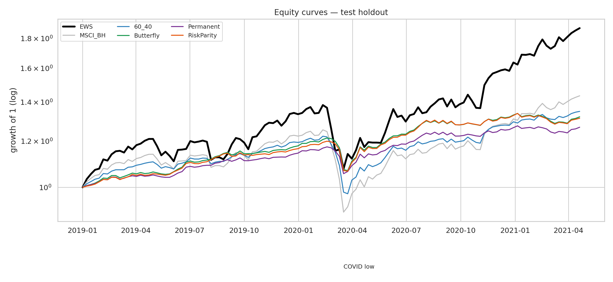
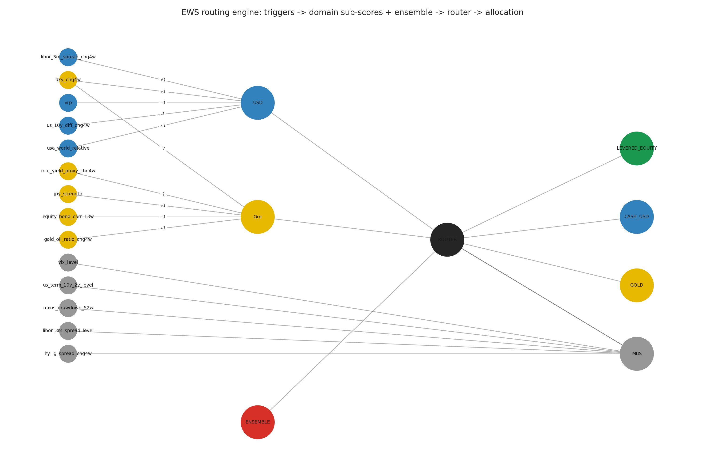

# Early Warning System for Risk-Off Detection — A Quant Strategy

[](https://colab.research.google.com/github/FrancescoImpenati/NewTechHackaton/blob/main/notebooks/EWS_GSoM_PoliMI.ipynb)

## Overview

An end-to-end weekly **Early Warning System** that detects risk-off transitions in
global markets and routes a portfolio into a context-appropriate safe haven.
Built on the Bloomberg weekly export 2000–2021 (1,107 obs, 43 features, binary
target `Y`).

The strategy itself is a **Quant Strategy**, not a risk-management overlay:

- **risk-on weeks** → 1.5× equity / −0.5× cash (levered)
- **risk-off weeks** → routed into one of three havens
  - `CASH_USD` — when the USD sub-score and DXY momentum point to a dollar squeeze
  - `GOLD`     — when the gold sub-score (real yields / fiat distrust) dominates
  - `MBS`      — when a binary rule says we are in moderate (not acute) stress

Framing is **nowcasting, not forecasting**: detect stress at birth, not predict
it ahead.

## Methodology

Each stage is a module under `src/`, composed end-to-end in
[`notebooks/EWS_GSoM_PoliMI.ipynb`](notebooks/EWS_GSoM_PoliMI.ipynb):

- **Feature engineering** — per-family stationarity transforms (log-returns for
  prices, first differences for yields, level for already-stationary signals),
  8 macro spreads (term / sovereign / credit log-ratios) and 4 standalone
  signals (VRP, gold/oil, equity-bond rotation, JPY strength). Pairs with
  `|corr| > 0.9` are dropped → **56 model features**.
- **Walk-forward CV with embargo** — 5 expanding folds + a **4-week embargo
  gap** between train end and val start (kills 4-week-lookback leakage); a
  sealed **2019–2021 test holdout** containing COVID. `StandardScaler` fit
  per fold on that fold's train only. Cross-fold metrics aggregated
  **weighted by `n_pos`** (folds 1–2 carry the signal).
- **Four anomaly detectors** fit on `Y == 0` normals only:
  - **MVG** with Ledoit-Wolf shrinkage (interpretable Mahalanobis distance)
  - **One-Class SVM** (RBF kernel; grid `ν × γ`)
  - **Autoencoder** `56-24-12-6-12-24-56`, dropout 0.15, internal temporal
    early-stopping (never on the val fold)
  - **Isolation Forest**, 200 trees
- **Soft-voting ensemble** — raw scores mapped to empirical percentiles vs
  train normals, aggregated by **soft median** (the winner). Threshold τ tuned
  walk-forward.
- **Three-domain routing engine** — sub-scores `USD`, `Gold` (signed-z-score
  means calibrated on the development set) and `MBS` (binary rule, active in
  moderate stress, blocked in acute crises). Thresholds optimized by **Calmar
  grid search** (duration-weighted median) → `τ_usd = 1.5, τ_oro = 0.5`.
- **Backtest** — weights lagged 1 week (no look-ahead), one-way bps TC
  per asset (5/5/8/2/20 for equity/bond/gold/cash/mbs), full risk-adjusted
  metric suite (Sharpe, Sortino, Calmar, Information Ratio, Tail Ratio, COVID
  crash DD & recovery, turnover, …).

## Results

Sealed test holdout 2019-01 → 2021-04 (121 weeks, includes COVID).
**EWS wins Sharpe, Sortino, Calmar and CAGR across all 5 benchmarks** and
recovers from COVID in 22 weeks vs MSCI's 35.

| Strategy        | CAGR  | Sharpe | Sortino | Calmar | Max DD | COVID DD | Recovery |
|-----------------|------:|-------:|--------:|-------:|-------:|---------:|---------:|
| **EWS**         | **0.310** | **1.45** | **2.22** | **1.39** | −0.22  | −0.21    | **22 w** |
| MSCI buy-and-hold | 0.168 | 0.98 | 1.31 | 0.61 | −0.28 | −0.27 | 35 w |
| 60 / 40 static  | 0.137 | 1.10 | 1.47 | 0.68 | −0.20 | −0.20 | 33 w |
| Butterfly       | 0.127 | 1.32 | 1.80 | 1.06 | **−0.12** | **−0.12** | 10 w |
| Permanent       | 0.107 | 1.34 | 1.81 | 1.07 | **−0.10** | **−0.10** | 11 w |
| Risk Parity     | 0.124 | 1.32 | 1.80 | 1.12 | −0.11 | −0.11 | 10 w |

EWS rotates into **GOLD** during the COVID crash (visible as the yellow wedge
in the allocation timeline). Honest nuance: always-defensive blends
(Butterfly / Permanent / Risk Parity) post smaller absolute drawdowns because
they are never fully invested in equity — EWS wins on **risk-adjusted return
and CAGR**, not on raw drawdown.





## Phase 2: feature selection & sensitivity

A second pass (notebooks `10`–`12`, modules `src/feature_selection.py` +
`src/sensitivity.py`) stress-tests the deployed pipeline. Methodology contract
unchanged: n_pos-weighted aggregation over the 5 walk-forward folds, per-fold
scalers fit on fold train only, the sealed 2019–2021 holdout touched exactly
once with a pre-frozen feature list.

- **τ sensitivity + fold-score cache** —
  [`notebooks/10_sensitivity_tau.ipynb`](notebooks/10_sensitivity_tau.ipynb):
  a persistent leakage-free fold-score cache (`outputs/cache/`, rebuild ~2 min,
  any τ sweep afterwards ~5 s). The production τ = 0.977 sits on an F1
  **plateau**; per-fold argmax-F1 τ* spans 0.88–1.00 (n_pos-weighted median
  0.9725). Tables: [`tau_curve.csv`](outputs/tables/tau_curve.csv),
  [`tau_stability.csv`](outputs/tables/tau_stability.csv); figure:
  [`tau_curve.png`](outputs/figures/tau_curve.png).
- **Clustered permutation importance** —
  [`notebooks/11_feature_selection.ipynb`](notebooks/11_feature_selection.ipynb)
  (part 1): 36 correlation clusters at t = 0.4
  ([`feature_clusters.csv`](outputs/tables/feature_clusters.csv)); joint-shuffle
  importance of each cluster on the soft-median ensemble val AUC-PR
  ([`cluster_importance.csv`](outputs/tables/cluster_importance.csv),
  [`cluster_importance.png`](outputs/figures/cluster_importance.png)). Top
  clusters: `it_de_10y`, `it_de_10y_chg4w`, the credit block, and
  `equity_bond_rot|hy_ig_spread_chg4w`; VIX shows ~zero *marginal* importance
  (correlated-features caveat — discussed in the notebook).
- **Nested subset curve + frozen list + single holdout shot** — (part 2):
  one representative per cluster (stage-1 AP with an extendability tie-break,
  [`cluster_representatives.csv`](outputs/tables/cluster_representatives.csv)),
  hypothesis keep `equity_bond_corr_13w`, pre-registered knee rule → **k = 36
  features, τ = 0.955**, frozen to
  [`selected_features.json`](outputs/tables/selected_features.json) *before*
  the one holdout evaluation: the frozen subset beats the full 56 on the
  holdout (AUC-PR 0.784 vs 0.753, F2 0.625 vs 0.534) —
  [`holdout_frozen_vs_full.csv`](outputs/tables/holdout_frozen_vs_full.csv),
  [`subset_curve.png`](outputs/figures/subset_curve.png).
- **Hyperparameter×τ surfaces + routing objectives** —
  [`notebooks/12_sensitivity_surfaces.ipynb`](notebooks/12_sensitivity_surfaces.ipynb):
  OC-SVM ν×τ and IF contamination×τ surfaces (IF scores are
  contamination-invariant — the flat surface is the finding);
  `optimize_routing_thresholds` generalized with an `objective` parameter
  (default = original Calmar behavior). The production (usd = 1.5, oro = 0.5)
  **survives every threshold-sensitive objective**; the concatenated-path
  Calmar identifies the grid best. Tables:
  [`svm_nu_tau_surface.csv`](outputs/tables/svm_nu_tau_surface.csv),
  [`if_contamination_tau_surface.csv`](outputs/tables/if_contamination_tau_surface.csv),
  [`routing_grid_objectives.csv`](outputs/tables/routing_grid_objectives.csv);
  figures under [`outputs/figures/`](outputs/figures).

Reproduce from the repo root: `python -m src.feature_selection` (stage-1
ranking + cluster counts) and `python -m src.sensitivity` (cache build/load +
τ sweep).

## Project structure

```
.
├── src/                        # composable modules (no notebook contains business logic)
│   ├── data_loader.py          # load + coverage report
│   ├── features.py             # stationarity + spreads + routing triggers
│   ├── splits.py               # walk-forward CV with embargo + sealed test
│   ├── preprocessing.py        # FoldScaler (per-fold + final)
│   ├── models.py               # MVG, OneClassSVM, Autoencoder, IsolationForest
│   ├── ensemble.py             # percentile mapping + 3 voting modes
│   ├── routing.py              # sub-scores + RoutingEngine + threshold optimization
│   ├── backtest.py             # weekly backtester + full metric suite
│   ├── feature_selection.py    # 3-stage feature selection (univariate AP, clusters, subsets)
│   └── sensitivity.py          # fold-score cache + tau / hyperparameter / routing sensitivity
├── data/
│   ├── raw/                    # Bloomberg .xlsx
│   └── processed/              # cleaned/engineered parquets (features, spreads, triggers,
│                               # walk-forward folds, sub-scores, allocations)
├── notebooks/
│   ├── 01_eda.ipynb            # EDA
│   ├── 03_models_mvg.ipynb     # MVG baseline
│   ├── 04_models_all.ipynb     # SVM + AE + IF
│   ├── 05_ensemble.ipynb       # ensemble + error-correlation analysis
│   ├── 06_subscores.ipynb      # USD / Gold / MBS sub-scores
│   ├── 07_routing_backtest.ipynb     # routing engine + 5-benchmark backtest
│   ├── 10_sensitivity_tau.ipynb      # fold-score cache + tau sensitivity (Phase 2)
│   ├── 11_feature_selection.ipynb    # clusters, importance, subset curve, holdout shot (Phase 2)
│   ├── 12_sensitivity_surfaces.ipynb # hyperparam x tau surfaces + routing objectives (Phase 2)
│   └── EWS_GSoM_PoliMI.ipynb   # end-to-end orchestration (~30 s)
├── outputs/
│   ├── models/                 # serialized scaler, 4 detectors, ensemble metadata
│   ├── cache/                  # persistent fold-score cache (Phase 2; layout in src/sensitivity.py)
│   ├── tables/                 # CSVs: per-model CV, comparison, threshold grid, metrics, equity curves
│   ├── figures/                # Phase-2 figures (dpi=200)
│   ├── EWS_pitch_deck.pptx     # 15-slide deliverable
│   └── presentation_speech.md  # ready-to-read speech
└── reports/figures/            # all generated figures (PNG)
```

## How to run

### Colab (one click)
Click the **Open in Colab** badge at the top. The first cell auto-clones the
repo and installs `requirements.txt`. Total wall time on a free CPU runtime
is roughly one minute.

### Local
```bash
git clone https://github.com/FrancescoImpenati/NewTechHackaton.git
cd NewTechHackaton
pip install -r requirements.txt

# rebuild every processed parquet + figure from scratch (~1 min):
python -m src.features
python -m src.splits

# the end-to-end notebook loads saved artifacts and runs in ~30 s:
jupyter nbconvert --to notebook --execute --inplace \
    notebooks/EWS_GSoM_PoliMI.ipynb
```

The individual stage notebooks (`03_*` through `07_*`) reproduce each step and
its figures; together they take ~5 minutes on a CPU.

---

*Academic project for **ML for Fintech**, GSoM Politecnico di Milano. The
Bloomberg dataset, target labelling and benchmark framing are provided by the
course; all modelling, engineering and deployment choices are ours and
documented inline.*
